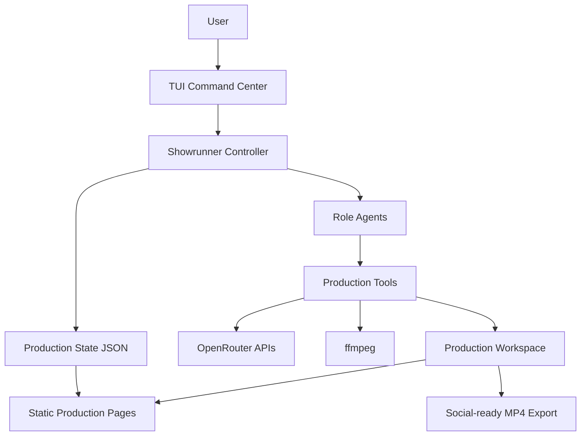
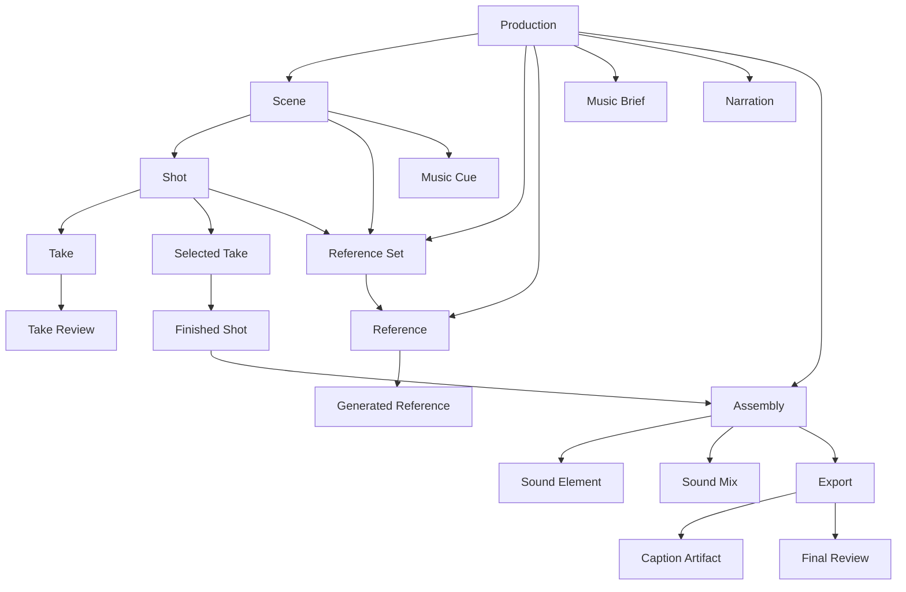

# Showrunner V0 Architecture

Showrunner is a local-first video-production harness. It starts from a natural-language brief, plans a Production, generates and reviews Shots, assembles Selected Takes, builds a production-quality Sound Mix, exports a social-ready MP4, and renders static HTML Production Pages for review and handoff.

V0 uses `@openrouter/agent` for the agent loop and role-agent orchestration, OpenRouter APIs for model/video/image/speech/audio generation, ffmpeg for assembly/export, JSON as the machine-readable Production State, and static HTML as the human review surface.

## Source Anchors

- Domain language: [CONTEXT.md](../CONTEXT.md)
- Architecture decisions: [docs/adr](./adr)
- TUI scaffold: `/Users/kenny/.codex/skills/create-agent-tui/SKILL.md`
- OpenRouter Agent SDK: https://openrouter.ai/docs/agent-sdk/overview
- OpenRouter video generation: https://openrouter.ai/docs/guides/overview/multimodal/video-generation
- OpenRouter TTS: https://openrouter.ai/docs/guides/overview/multimodal/tts
- OpenRouter audio: https://openrouter.ai/docs/guides/overview/multimodal/audio

## Goals

1. Produce complete Productions from brief to finished MP4.
2. Optimize for creative quality with Budget Guardrails.
3. Make OpenRouter model choice useful without making the user micromanage models.
4. Keep paid generation preview-first unless an Autonomy Policy explicitly permits automatic rendering.
5. Preserve provenance for every Take, Sound Element, Assembly, Export, and review.
6. Make the harness resumable through structured Production State and inspectable through static HTML Production Pages.

## Non-Goals For V0

- A hosted multi-user service.
- A full browser-based editing application.
- Professional NLE parity.
- Every export format and platform-specific delivery preset.
- Prompt management as a standalone product.
- Captions as a required artifact for every Production.

## Framework Choice

Use `@openrouter/agent` as the V0 framework.

The Agent SDK is the right inner loop for the Showrunner Controller and Role Agents because it provides model calls, tool execution, stop conditions, streaming, and conversation state while keeping OpenRouter at the center. Video, image, TTS, and audio generation should be exposed as custom tools that call the relevant OpenRouter APIs.

Flue should not be the V0 base. It is a strong future candidate for hosted, headless, durable runtime deployments, but V0 is a local TUI plus static artifact workflow.

## System Shape



## Production Hierarchy



## Stage Gates

The Showrunner Controller advances a Production through fixed stage gates. Role Agents have freedom inside each stage, but the controller should not skip gates.

| Stage | Owner | Output | Approval Default |
| --- | --- | --- | --- |
| Brief | Producer | Production brief, constraints, Budget Guardrail, optional Autonomy Policy | User confirms missing hard constraints |
| Scene plan | Director | Ordered Scenes with continuity context | No approval unless ambiguous |
| Shot plan | Director + Cinematographer | Ordered Shots with action, camera, timing, reference needs | No approval unless expensive/risky |
| Reference plan/assets | Cinematographer | References and Generated References | Approval for paid image generation unless covered |
| Takes | Cinematographer | Previewed video requests, submitted jobs, downloaded Takes | Approval before paid jobs by default |
| Take reviews | Reviewers | Layered Take Reviews | No approval |
| Selected takes | Controller + Reviewer | One Selected Take per completed Shot | User approval by default |
| Assembly | Editor | Finished Shots plus timeline with trims, ordering, transitions | No approval unless major story change |
| Sound mix | Sound Designer | Narration, Music Cues, Native Take Audio treatment, Sound Mix | Approval for paid audio/music generation by default |
| Export | Editor | H.264/AAC MP4 and optional Caption Artifacts | User approval by default |
| Final review | Specialized reviewers | Final Review with pass/fail and fixes | User signoff by default |

When a review fails, route work back to the narrowest stage that can fix it.

## Role Agents

All Role Agents are called by the Showrunner Controller. The user should not need to manage them directly.

### Producer

Responsibilities:

- Expand the natural-language brief.
- Identify target audience, platform, runtime, aspect ratio, budget, and exclusions.
- Decide whether Narration, Music Cues, Caption Artifacts, and References are needed.
- Ask only for missing constraints that materially affect output or cost.

Primary tools:

- `read_production_state`
- `update_production_state`
- `estimate_budget`
- `render_production_page`

### Director

Responsibilities:

- Create Scenes.
- Break Scenes into ordered Shots.
- Maintain continuity, emotional arc, pacing, and story logic.
- Flag continuity-critical Shots that need References.

Primary tools:

- `update_scenes`
- `update_shots`
- `validate_stage_state`

### Cinematographer

Responsibilities:

- Write Shot-level video prompts.
- Compile Reference-backed Motion Prompts for Take requests.
- Plan camera motion, subject motion, framing, lighting, style, timing, and frame safety.
- Generate or collect References.
- Preview and submit video generation requests.
- Preserve Take provenance.

Primary tools:

- `list_video_models`
- `choose_video_model`
- `preview_video_request`
- `submit_video_job`
- `poll_video_job`
- `download_take`
- `generate_reference`

### Editor

Responsibilities:

- Produce Finished Shots from Selected Takes through the Finishing Pipeline.
- Build the Assembly from Finished Shots, falling back to raw Selected Takes only when finishing has not run.
- Trim, order, transition, pad, scale, and render.
- Produce social-ready MP4 Exports.
- Generate optional Caption Artifacts when requested.

Primary tools:

- `probe_media`
- `finish_selected_take`
- `extract_keyframes`
- `build_assembly_plan`
- `render_export`
- `render_caption_artifact`

### Sound Designer

Responsibilities:

- Generate or import Narration.
- Generate or import Music Cues.
- Decide how to use Native Take Audio.
- Build the Sound Mix with fades, ducking, loudness, and timing.

Primary tools:

- `list_audio_models`
- `generate_narration`
- `generate_music_cue`
- `analyze_audio`
- `mix_audio`

### Reviewers

Responsibilities:

- Produce specialized reviews rather than one generic judgment.
- Review visual continuity and artifacts.
- Review story/brief fit.
- Review audio/music/narration quality.
- Review platform/export compliance.
- Review cost/provenance completeness.
- Aggregate findings into a Final Review.

Primary tools:

- `probe_media`
- `extract_keyframes`
- `review_take`
- `review_export`
- `aggregate_final_review`

## Model Routing

Routing is automatic by default and overrideable per role and modality.

Text-heavy creative jobs use Role Models selected through OpenRouter discovery. Director planning, Motion Prompt writing, Scriptwriter narration/dialogue, and review should use frontier text models when available; the Showrunner Controller model is only the fallback.

Director planning should first classify the video kind and produce a kind-specific Production Process before paid generation. Short films, music videos, trailers, marketing videos, explainers, documentaries, and social clips have different goals, required decisions, required assets, shot design rules, audio plans, and review criteria.

After the Production Process, planning should produce a Story Treatment and Audio Strategy. The treatment names the protagonist, goal, obstacle, stakes, ending, grounding rules, and style rules. The audio strategy decides whether the production is dialogue-led, narration-led, music-led, native-audio-led, hybrid, or silent so Showrunner does not default every production into the same narrator-over-montage workflow.

Policy examples:

- `best_quality`: prefer stronger planning/review models and higher-quality generation models.
- `balanced`: prefer quality but cap obvious overspend.
- `budget_aware`: use cheaper models for planning, metadata, formatting, and low-risk Shots while preserving quality floor for final generation.

Override examples:

```json
{
  "routing": {
    "policy": "balanced",
    "roles": {
      "producer": { "model": "anthropic/claude-sonnet-4.6" },
      "director": { "model": "anthropic/claude-sonnet-4.6" },
      "reviewer": { "model": "anthropic/claude-sonnet-4.6" }
    },
    "modalities": {
      "video": { "preferredModels": [] },
      "image": { "preferredModels": [] },
      "speech": { "preferredModels": [] },
      "music": { "preferredModels": [] }
    }
  }
}
```

The harness should discover current model capabilities at runtime. Do not hardcode current video, image, speech, or music model lists into the domain logic.

## Production Workspace

Each Production should live in a directory under `productions/`.

```text
productions/
  prod_2026_05_21_example/
    production.json
    stage-state.json
    scenes.json
    shots.json
    references.json
    takes.jsonl
    take-reviews.jsonl
    sound.json
    assemblies.json
    exports.json
    final-reviews.jsonl
    costs.jsonl
    approvals.jsonl
    assets/
      references/
      generated-references/
      takes/
      finished/
      audio/
      captions/
    pages/
      production.html
      scenes.html
      shots.html
      review.html
    exports/
      production.mp4
```

JSON files are the source of truth. Static HTML files are renderings for humans.

## State Schemas

These are conceptual TypeScript shapes. Implementation should use Zod schemas and write JSON atomically.

```ts
type Stage =
  | "brief"
  | "scene_plan"
  | "shot_plan"
  | "references"
  | "takes"
  | "take_reviews"
  | "selected_takes"
  | "assembly"
  | "sound_mix"
  | "export"
  | "final_review";

type Production = {
  id: string;
  title: string;
  brief: string;
  target: {
    platform?: string;
    aspectRatio: "16:9" | "9:16" | "1:1";
    runtimeSeconds?: number;
    format: "mp4";
  };
  budgetGuardrail: {
    maxUsd?: number;
    approvalThresholdUsd?: number;
    spentUsd: number;
  };
  autonomyPolicy?: {
    enabled: boolean;
    maxUsd: number;
    maxTakesPerShot: number;
    allowedModels?: string[];
    finalReviewThreshold: "pass" | "pass_with_minor_issues";
  };
  routing: RoutingConfig;
  stage: Stage;
  createdAt: string;
  updatedAt: string;
};

type Scene = {
  id: string;
  productionId: string;
  order: number;
  title: string;
  purpose: string;
  continuity: {
    location?: string;
    characters?: string[];
    style?: string;
    lighting?: string;
    emotionalBeat?: string;
    audioIntent?: string;
  };
  musicCueIds: string[];
};

type Shot = {
  id: string;
  sceneId: string;
  order: number;
  intent: string;
  durationSeconds: number;
  promptDraft: string;
  camera: string;
  subjectMotion: string;
  continuityCritical: boolean;
  referenceSetIds: string[];
  referenceIds: string[];
  selectedTakeId?: string;
  status: "planned" | "previewed" | "rendering" | "needs_review" | "selected" | "needs_fix";
};

type ReferenceSet = {
  id: string;
  ownerType: "production" | "scene" | "shot";
  ownerId: string;
  name: string;
  purpose: "production_continuity" | "character_continuity" | "shot_continuity" | "environment_continuity" | "prop_continuity" | "frame_continuity";
  requiredKinds: Array<"character_sheet" | "wardrobe_sheet" | "prop_scale" | "environment_plate" | "style_frame" | "first_frame" | "last_frame" | "return_frame">;
  referenceIds: string[];
};

type Take = {
  id: string;
  shotId: string;
  model: string;
  request: unknown;
  jobId?: string;
  generationId?: string;
  status: "previewed" | "pending" | "in_progress" | "completed" | "failed" | "rejected";
  mediaPath?: string;
  nativeAudio?: {
    present: boolean;
    extractedPath?: string;
    intendedUse: "keep" | "mute" | "duck" | "replace" | "undecided";
  };
  costUsd?: number;
  createdAt: string;
};

type FinishedShot = {
  id: string;
  shotId: string;
  takeId: string;
  sourcePath: string;
  outputPath: string;
  status: "planned" | "completed" | "failed";
  pipeline: {
    upscale: boolean;
    cleanup: boolean;
    grain: boolean;
    targetResolution: "source" | "1080p" | "4k";
    frameRate?: number;
    adapter: string;
  };
  createdAt: string;
  completedAt?: string;
};

type TakeReview = {
  id: string;
  takeId: string;
  reviewer: "media" | "visual" | "story" | "audio" | "provenance" | "human";
  verdict: "pass" | "needs_fix" | "reject";
  findings: string[];
  requiredFixes: string[];
  optionalImprovements: string[];
};

type Assembly = {
  id: string;
  productionId: string;
  selectedTakeIds: string[];
  timeline: Array<{
    takeId: string;
    startSeconds: number;
    endSeconds: number;
    transition?: "cut" | "fade";
  }>;
  soundMixId?: string;
};

type SoundMix = {
  id: string;
  assemblyId: string;
  narrationIds: string[];
  musicCueIds: string[];
  nativeTakeAudio: Array<{
    takeId: string;
    treatment: "keep" | "mute" | "duck" | "replace";
  }>;
  loudnessTarget: string;
  outputPath?: string;
};

type Export = {
  id: string;
  assemblyId: string;
  path: string;
  format: "mp4";
  codec: "h264";
  audioCodec: "aac";
  aspectRatio: "16:9" | "9:16" | "1:1";
  captionArtifactIds: string[];
  finalReviewId?: string;
};
```

## Core Tools

### State Tools

- `create_production`
- `read_production_state`
- `update_production_state`
- `advance_stage`
- `validate_stage_state`
- `record_cost`
- `record_approval`

### Model Discovery And Routing Tools

- `list_text_models`
- `list_video_models`
- `list_image_models`
- `list_speech_models`
- `list_audio_models`
- `choose_model`
- `preview_generation_cost`

### Reference Tools

- `import_reference`
- `create_reference_set`
- `plan_reference_craft`
- `generate_reference`
- `describe_reference`
- `attach_reference`
- `validate_reference_set_readiness`

### Video Tools

- `preview_video_request`
- `submit_video_job`
- `poll_video_job`
- `download_take`
- `extract_native_take_audio`

### Audio Tools

- `generate_narration`
- `generate_music_cue`
- `transcribe_audio`
- `analyze_audio`
- `mix_audio`

### Media And Export Tools

- `probe_media`
- `extract_keyframes`
- `finish_selected_take`
- `validate_finished_shot`
- `build_assembly_plan`
- `render_export`
- `render_caption_artifact`

### Review Tools

- `review_take`
- `review_export_visuals`
- `review_export_story`
- `review_export_audio`
- `review_export_compliance`
- `review_export_provenance`
- `aggregate_final_review`

### HTML Tools

- `render_production_page`
- `render_scene_page`
- `render_review_page`

## Approval Rules

Default mode pauses before:

- Paid video generation.
- Paid image/reference generation.
- Paid speech, audio, or music generation.
- Promoting a Take to Selected Take.
- Rendering the final Export.
- Marking Final Review as complete.

Autonomous mode may proceed only when an Autonomy Policy covers the action.

Only one paid preview should have a pending approval at a time. The controller must require the user to approve, cancel, or explicitly supersede the pending preview before creating another paid generation preview, otherwise Takes can be stranded outside the approval ledger.

## Conversational TUI

The TUI should feel like a messaging interface, not a command shell. Normal user input goes to the Showrunner Controller through OpenRouter and the Agent SDK. The controller interprets intent, then calls deterministic tools to create Productions, advance stage gates, approve pending work, inspect model capabilities, render pages, or report status.

Showrunner maintains a single Persistent Thread in `.showrunner/thread.json` by default. Each normal turn is saved with the active Production directory and Showrunner model. Before a model turn, the harness builds context from the Thread Summary, retained head/recent turns, and the current Production State snapshot, then sends the new user message to the controller.

Auto compaction is production-aware. It compacts older middle turns into a Thread Summary that preserves creative constraints, approvals, model and routing decisions, budget guardrails, artifact paths, unresolved questions, and the next production action. It keeps the first turns and recent turns verbatim, uses OpenRouter model discovery for context length when available, and falls back to configured context limits when discovery is unavailable.

Examples:

- "Make a 20 second vertical product teaser with narration and music"
- "Continue until you need my approval"
- "Yes, approve that take"
- "What is the current production status?"
- "Show me what video models are available"
- "How full is context?"
- "Compact context"

Slash commands can remain as debug shortcuts for development:

- `/context`
- `/compact`
- `/new <brief>`
- `/load <dir>`
- `/status`
- `/next`
- `/approve`
- `/action <type>`
- `/models video`
- `/page`
- `/ask <prompt>`
- `/exit`

The implementation should not require users to remember these commands for the main workflow.

## Static Production Pages

V0 should generate static HTML pages from Production State:

- `production.html`: brief, stage progress, budget, model routing, current blockers, final export link.
- `scenes.html`: ordered Scenes, continuity notes, Music Cues, Narration needs.
- `shots.html`: Shots, References, Takes, Selected Takes, Take Reviews.
- `review.html`: Final Review, specialized findings, required fixes, optional improvements.

Pages should embed or link local media using relative paths so the whole Production folder can be moved as an artifact.

## Implementation Plan

### Slice 1: Scaffolding

- Generate TypeScript TUI project from the create-agent-tui pattern.
- Add `@openrouter/agent`, Zod, TypeScript, tsx, and basic config.
- Add state directory conventions and schema modules.
- Add empty role-agent prompts and controller loop.

### Slice 2: Production State

- Implement Production State creation, validation, loading, saving, and stage advancement.
- Add approval and cost ledgers.
- Add `/brief`, `/status`, and `/page`.

### Slice 3: Planning Roles

- Implement Producer, Director, and Cinematographer planning flows.
- Generate Scenes, Shots, Reference plans, and Shot prompt drafts.
- Compile Take Motion Prompts from Shot structure and Reference readiness.
- Render initial static pages.

### Slice 4: Model Discovery And Request Preview

- Add runtime model discovery for video, image, speech, and audio.
- Add routing policies and role/model overrides.
- Add preview tools for video/reference/audio generation.
- Enforce approval gates.

### Slice 5: Video Generation

- Implement submit, poll, download, and provenance capture for video jobs.
- Store Takes and Take Reviews.
- Implement Selected Take promotion.

### Slice 6: Sound

- Implement Dialogue and Narration generation through TTS.
- Implement Music Cue generation through discovered audio-capable models.
- Extract and treat Native Take Audio as a Sound Element.
- Build a first Sound Mix with ffmpeg that preserves dialogue, narration, music, and ducked Native Take Audio.

### Slice 7: Assembly And Export

- Build Assembly planning and ffmpeg export.
- Render H.264/AAC MP4 in 16:9, 9:16, or 1:1.
- Generate optional Caption Artifacts.

### Slice 8: Final Review And Repair

- Implement specialized final reviewers.
- Aggregate one Final Review.
- Route failures to the narrowest fix stage.

## First Acceptance Test

Given a one-sentence brief for a short vertical video, Showrunner should:

1. Create a Production.
2. Plan Scenes and Shots.
3. Identify whether References, Narration, Music Cues, and Caption Artifacts are needed.
4. Preview the first paid generation request.
5. Require approval before spending.
6. Record a Take with provenance after generation.
7. Review and select a Take.
8. Build an Assembly and Sound Mix.
9. Render a social-ready MP4.
10. Render static Production Pages.
11. Produce a Final Review with required fixes or pass.

## Open Questions

- Which exact ffmpeg defaults should V0 use for loudness, bitrate, and scaling?
- Should the first TUI store sessions globally or inside each Production directory?
- What is the default approval threshold in dollars?
- Which routing policy should be the default: `balanced` or `best_quality`?
- Should a failed Final Review automatically repair in autonomy mode, or stop after one repair cycle?
